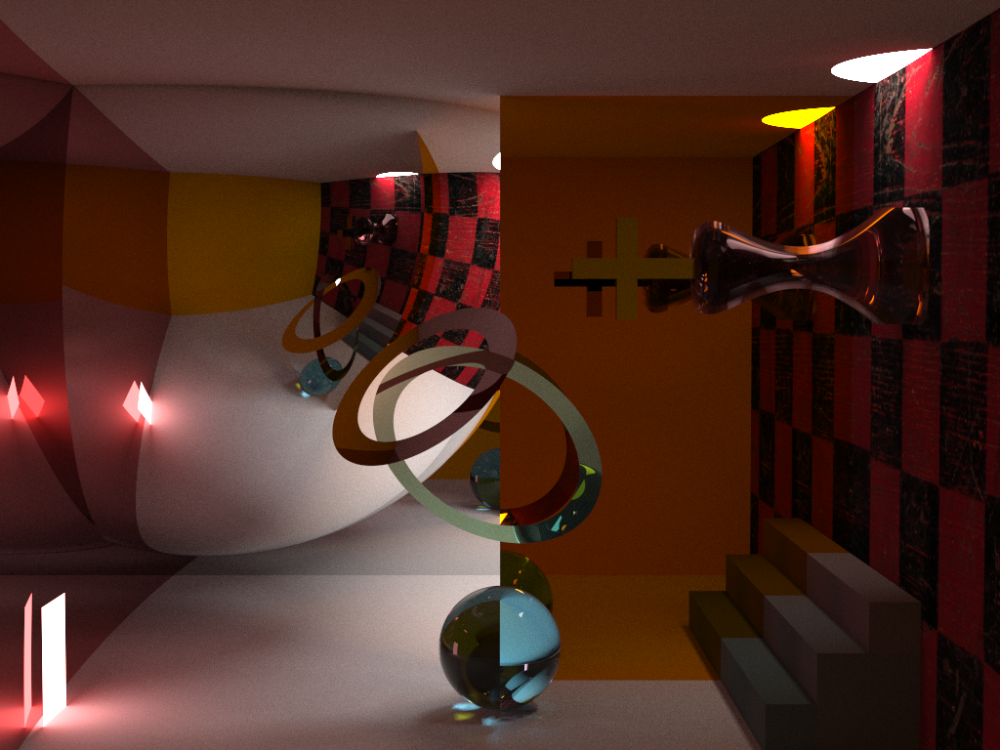

SCHNEll Ray Tracer
------------------
Ray Tracer project for THU Course `Advanced Computer Graphics`

<i>劇院休息室的幻影</i>

<i>Tell Your Ghost to Dance</i>

## Features
- Monte Carlo Path Tracing
    - Specular Reflection
    - Diffuse Reflection
    - Refraction (Beer's Law)
- Supported objects:
    - Spheres
    - Planes
    - Axis-aligned boxes
    - Bezier rotational surface (*WARNING* can be devastatingly slow)
        - intersection solved using Newton's method, attempt = 10, iteration = 5
    - Floating disks with hole
- Natively supports smooth shadows and caustics by MCPT.
- (Curved) Modified Cornell Box Scene.
- Scene specification format referenced from Raina Tam's implementation (private conversation).

## References
- [Smallpt](http://www.kevinbeason.com/smallpt/)
- [Scratch Pixel](https://www.scratchapixel.com/)
- Student Raina Tam's implementation (PPM & Bezier curve)